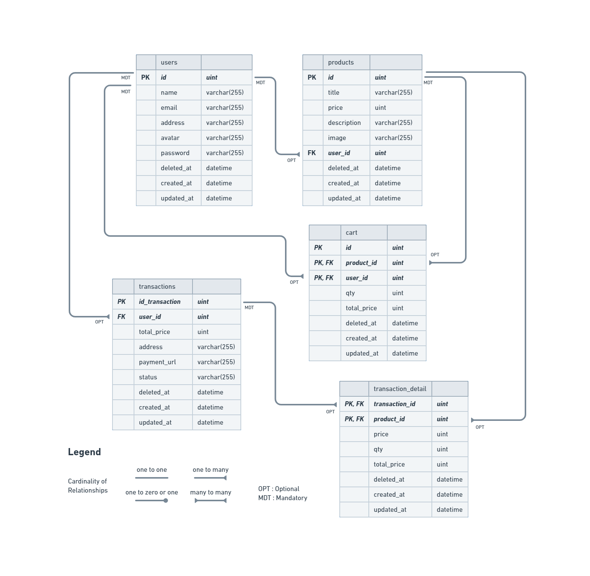

# Ecommerce-API

RESTful API for our  [E-Commerce App Project](https://github.com/four-squad/ecommerce-FE)

Where users can post products, buy & sell their goods. It is built with Golang, MySQL, Docker, AWS EC2, etc.

# ⚡Features
 - [x] CRUD (Users, Cart, Transactions)
 - [x] Hashing passwordgit 
 - [x] Authentication & Authorization
 - [x] Database Migration
 - [x] Automated deployment with GitHub Actions, DockerHub & AWS EC2
 - [ ] Midtrans Integration as Payment Gateway

# 📂 Folder Structure Pattern

```
├── .github
│   └── workflows
│       └── main.yml
├── config
│   └── cloudinary.go
│   └── config.go
│   └── db.go
└── features
│   └── cart
│   │   └── data
│   │   │   └── model.go
│   │   │   └── query.go
│   │   └── handler
│   │   │   └── handler.go
│   │   │   └── request.go
│   │   │   └── response.go
│   │   └── services
│   │   │   └── service_test.go
│   │   │   └── service.go
│   │   └── entity.go
│   └── product
│   │   └── data
│   │   │   └── model.go
│   │   │   └── query.go
│   │   └── handler
│   │   │   └── handler.go
│   │   │   └── request.go
│   │   │   └── response.go
│   │   └── services
│   │   │   └── service_test.go
│   │   │   └── service.go
│   │   └── entity.go
│   └── user
│   │   └── data
│   │   │   └── model.go
│   │   │   └── query.go
│   │   └── handler
│   │   │   └── handler.go
│   │   │   └── request.go
│   │   │   └── response.go
│   │   └── services
│   │   │   └── service_test.go
│   │   │   └── service.go
│   │   └── entity.go
│   └── transaction
│   │   └── data
│   │   │   └── model.go
│   │   │   └── query.go
│   │   └── handler
│   │   │   └── handler.go
│   │   │   └── request.go
│   │   │   └── response.go
│   │   └── services
│   │   │   └── service_test.go
│   │   │   └── service.go
│   │   └── entity.go
└── helper
│   └── cloudinary_helper.go
│   └── dto.go
│   └── jwt.go
│   └── pwd.go
│   └── response.go
└── mocks
├── .gitignore
├── dockerfile
├── ecommerce.yaml
├── erd.png
├── go.mod
├── go.sum
├── LICENSE
├── local.env.example
├── main.go
└── README.md
```

# 🔥 Open API

Simply [click here](https://app.swaggerhub.com/apis-docs/TECHMIN7_1/Ecommerce/1.0.0#/) to see the details of endpoints we have agreed with our FE team.
# 🔗 ERD



# 💻 Tools & Stacks
- Backend Stacks :
  - [Golang](https://go.dev/) : Programming Language
  - [Viper](https://github.com/spf13/viper) : Environment Reader
  - [Echo](https://echo.labstack.com/) : Web Framework
  - [JWT](https://jwt.io/) : Authentication & Authorization
  - [GORM](https://gorm.io/) : ORM Library
  - [MySQL](https://gorm.io/) : Database Management System
- Documentation :
  - [Postman](https://www.postman.com/) : API Testing & Documentation
  - [Swagger](https://swagger.io/) : Open API Documentation
- Deployment & Storage :
  - [Ubuntu](https://ubuntu.com/) : Development & Deployment OS
  - [Docker](https://docker.com/) : Containerization
  - [Amazon EC2](https://aws.amazon.com/) : Cloud server
  - [Cloudinary](https://cloudinary.com/) : Store and retrieve images
  - [Cloudflare](https://www.cloudflare.com/) : SSL & Proxy

# 🛠️ How to Run Locally

- Clone it

```
$ git clone https://github.com/four-squad/ecommerce-API
```

- Go to directory

```
$ cd ecommerce-api
```

- Create a new database

- Rename `local.env.example` to `local.env`
- Adjust `local.env` as your environment settings

- Run the project

```
$ go run .
```
- Voila! 💫 

# 🤖 Author

- Devangga Wiku :

    [](https://github.com/DevWiku) 

- Muhammad Habibullah :

    [](https://github.com/hebobibun) 


<h5>
<p align="center">Built with ❤️ by Four Squad ©️ 2023</p>
</h5>